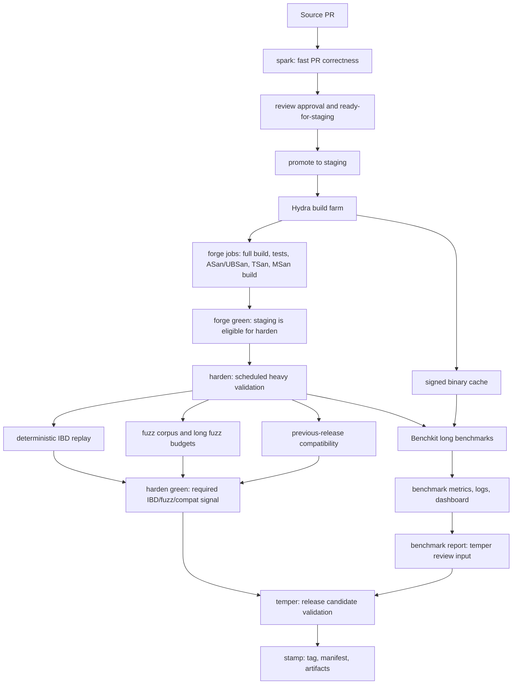
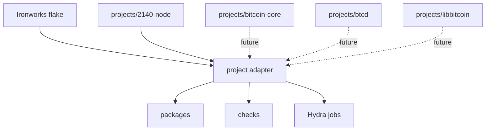

# Ironworks: External CI, Packaging, Staging, Release, And Benchmarking

The proposal is to make `2140-dev/ironworks` the external build and release
infrastructure repo.

The source repository should keep owning implementation details:

- build files
- tests
- install rules
- source branches
- source review

Ironworks should own the external production pipeline:

- Nix dependency pins
- project adapters
- package profiles
- CI stages
- Hydra jobsets
- cache policy
- promotion tooling
- release manifests
- scheduled harden and benchmark orchestration

## Stage Vocabulary

| Stage | Purpose |
| --- | --- |
| `spark` | Fast PR correctness checks. |
| `forge` | Staging integration for reviewed changes. |
| `harden` | Scheduled heavy validation and measurement: IBD, fuzz corpus, compatibility, benchmarks. |
| `temper` | Release candidate validation. |
| `stamp` | Final tag, manifest, and artifact publication. |

## Pipeline



## Project Adapter Model

Ironworks should be generic. The top-level flake is the common stage framework.
Implementation-specific assumptions live in project adapters.



The current default adapter is:

```text
projects/2140-node/default.nix
```

That adapter is Bitcoin-Core-like. It knows about:

- CMake package profiles
- CTest
- `bitcoind`
- `bitcoin-cli`
- regtest smoke checks
- fuzz binary builds
- sanitizer builds
- benchmark sanity checks
- release manifests

Future adapters can map the same stage model onto different implementations:

```text
projects/bitcoin-core/default.nix
projects/btcd/default.nix
projects/libbitcoin/default.nix
```

Each adapter defines how that implementation builds, tests, smokes, fuzzes,
benchmarks, and releases.

## Workflow

PRs run `spark` in GitHub Actions. The source checkout is passed into
Ironworks as a Nix input override, so the source repo does not need to own the
full CI environment.

Reviewed PRs that pass `spark` can be explicitly promoted to `staging`.

`forge` is the Hydra-backed integration CI for the staging branch. It should run
the full build/test surface plus sanitizer-oriented jobs such as ASan/UBSan,
TSan, and MSan build checks. A staging commit is not eligible for long-running
`harden` jobs until `forge` is green.

`harden` jobs are scheduled, not per-merge, and should select only forge-green
staging snapshots. This stage contains both required validation jobs and
advisory measurement jobs. Deterministic IBD replay, fuzz corpus runs, long fuzz
budgets, and previous-release compatibility are required harden signals. Long
benchmarks run from the same forge-green snapshot, but their result feeds
`temper` as release-review evidence rather than acting as an automatic hard
blocker.

Benchmarks should be Hydra-adjacent and temper-visible:

- Hydra builds exact artifacts.
- Benchkit runs measurements on dedicated hardware.
- Results go to a database, artifact store, dashboard, and release comparison
  report.

Benchmark regressions should be reviewed in `temper`. A regression can block a
release by release-manager decision, or it can be explicitly accepted when the
tradeoff is understood and recorded.

Releases are cut from staging commits that are `forge` green, required
`harden` green, and have current benchmark evidence available to `temper`. A
release candidate then passes `temper`, and `stamp` publishes tags, manifests,
and artifacts.

## Why This Shape

This keeps PR feedback fast while still giving us heavier integration signal.

It also separates responsibilities cleanly:

- source repos own source-level concerns
- Ironworks owns production build/release infrastructure
- project adapters capture implementation-specific assumptions
- Hydra builds trusted artifacts
- scheduled jobs watch long-term staging health
- dedicated benchmark workers produce reproducible measurements

The result should be reusable across `2140-node`, Bitcoin Core, btcd,
libbitcoin, and other node implementations without forcing every project to
copy the same CI and release machinery.
