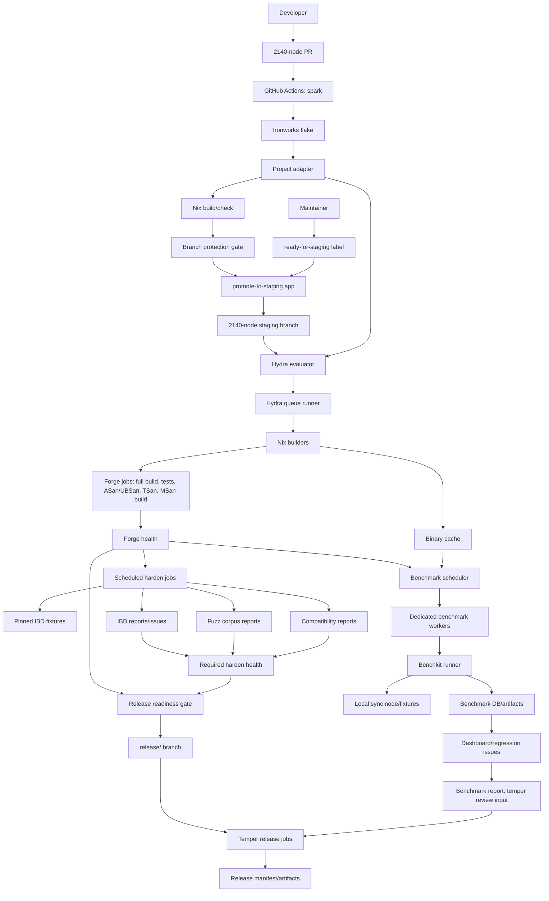

# Ironworks Production Architecture

This document describes the intended production system around Ironworks:
PR correctness, staging promotion, Hydra builds, scheduled IBD/fuzz,
long-running benchmarks, and releases.

It is both a design sketch and a rollout checklist. Keep it updated as the
pipeline moves from local validation to hosted production.

## Current State

Implemented in this repository:

- Nix package profiles for correctness, staging, fuzz, sanitizer, and release
- a default `projects/2140-node` adapter
- flake checks for correctness, staging, and release
- Hydra job exports under `hydraJobs.${system}`
- GitHub Actions workflow for Ironworks
- source-repository correctness workflow template
- local promotion helper for reviewed PRs to `staging`
- documentation for workflow, jobsets, and design notes

Validated locally against `/home/josie/2140-node`:

- `nix fmt`
- `nix flake check --no-build --all-systems --print-build-logs`
- `checks.x86_64-linux.correctness`
- `checks.x86_64-linux.staging`
- `checks.x86_64-linux.release-manifest`

Not yet productionized:

- Ironworks repository remote
- source repository workflow installation
- branch protection and labels
- binary cache configuration
- Hydra server and builders
- scheduled harden jobs
- benchmark service and dedicated workers
- release artifact publishing

## Architecture



## Component Responsibilities

### Source Repository

The source repository owns the node implementation:

- CMake targets and options
- source tests
- install rules
- PR branches, `master`, `staging`, and release branches

It should contain only the thin workflow needed to call Ironworks' correctness
check.

### Ironworks Repository

This repository owns the external build and CI model:

- dependency pins
- project adapters
- Nix package profiles
- GitHub Actions definitions
- Hydra job exports
- promotion tooling
- release manifest generation
- docs for CI, staging, release, and benchmarking architecture

The current top-level flake exposes one default adapter directly. Today that is
`projects/2140-node`. Additional implementations should be added as separate
adapters rather than by mixing build-system assumptions into `flake.nix`.

### GitHub Actions: Spark

GitHub Actions is the first production gate:

- runs correctness on source PRs
- runs flake evaluation and correctness on packaging PRs
- provides fast developer feedback before Hydra is involved

It should not run expensive scheduled IBD or long benchmark work.

### Hydra

Hydra is the trusted build farm for protected refs:

- builds staging and release jobsets
- builds expensive sanitizer profiles
- publishes signed binary cache outputs
- retains build logs and derivation provenance
- provides exact artifacts for benchmark workers

Hydra should initially build trusted refs only:

- Ironworks `master`
- source repository `staging`
- source repository `release/*`

PR correctness should stay in GitHub Actions until there is a reason to move it.

### Binary Cache

The cache is the bridge between all systems:

- GitHub Actions can reuse package outputs
- Hydra can publish trusted outputs
- developers can reproduce failures faster
- benchmark workers can consume exact binaries without rebuilding

Use either Hydra's cache, Cachix, or both. The important production properties
are signing, documented retention, and explicit trusted public keys.

### Scheduled Health Jobs: Harden

Scheduled health jobs are expensive integration signals. They should run on a
schedule against current `staging`, not on every staging merge.

Examples:

- deterministic IBD prefix replay
- larger IBD replay
- previous-release upgrade/import compatibility
- pinned fuzz corpus runs
- long fuzz budgets
- benchmark artifact builds

Required validation failures should mark staging unhealthy and open or update
issues. They should not automatically block every ordinary staging merge unless
the job becomes fast, stable, and high-signal.

Benchmark regressions are different: they are scheduled harden outputs, but
they feed `temper` as release-review input instead of directly setting required
harden health.

### Benchmark Service: Harden

Long-running benchmarks should be Hydra-adjacent rather than Hydra derivations.

Hydra builds exact benchmark binaries. The benchmark service measures them on
dedicated hardware.

This preserves two separate guarantees:

- Hydra/Nix: reproducible inputs and binaries
- benchmark workers: controlled measurement environment

Benchkit is the preferred runner layer. Its public README describes YAML
benchmark definitions, parameter matrices, CPU affinity, system tuning,
profiling/perf instrumentation, Nix development support, lifecycle hooks, and
AssumeUTXO snapshot management:
https://github.com/bitcoin-dev-tools/benchkit

The missing production pieces around Benchkit are:

- scheduler
- worker lease/dispatch
- artifact upload
- result database
- baseline comparison
- issue or notification integration

## Primary Flows

### 1. Spark: PR Correctness

```text
source PR
  -> GitHub Actions checks out source
  -> GitHub Actions checks out Ironworks
  -> nix build checks.x86_64-linux.correctness with node override
  -> branch protection gates merge
```

Correctness is intentionally local-reproducible. If a developer cannot run the
same check locally, it does not belong in correctness.

### 2. Promotion To Forge

```text
PR correctness green
  -> review approval
  -> maintainer applies ready-for-staging
  -> promote-to-staging merges PR head into staging
  -> staging jobs run
```

Promotion merge commits should record:

- PR number
- PR head SHA
- target branch
- UTC promotion timestamp

This makes release selection and staging failure analysis traceable.

### 3. Forge: Staging CI

```text
staging branch update
  -> Hydra evaluates staging jobset
  -> builders run forge jobs
  -> results update forge health
```

Forge jobs should map to:

- full package build
- full unit tests
- ASan/UBSan
- TSan
- MSan build-only
- adapter-specific cheap sanity checks when useful

### 4. Harden: Scheduled IBD

IBD should be deterministic and scheduled.

Harden jobs should only select forge-green staging snapshots. We do not want
IBD, long fuzzing, or long benchmark work spending time on code that has not
passed the Hydra-backed forge stage.

Do not define production IBD as "connect to random public peers and sync." That
is hard to reproduce, slow, and fragile.

Use pinned inputs instead:

- block file prefixes
- compact block-serving fixtures
- AssumeUTXO snapshots
- previous-release datadirs
- local trusted sync node snapshots

The scheduled job should:

- fetch fixture by content hash
- run from a clean datadir
- disable public peer discovery unless explicitly testing networking
- stop at an expected height/hash
- emit logs and a compact report

Staging policy:

- required harden failure marks staging unhealthy
- issue records failing commit, last known green commit, fixture id when
  relevant, and logs
- fixes go through normal PR correctness and promotion

Release policy:

- release candidates require recent green required harden results, or explicit
  reruns on the release branch
- benchmark comparison reports must be available to `temper` for review

### 5. Harden: Long-Running Benchmarks

The benchmark path should look like this:

```text
staging or release commit selected
  -> Hydra builds benchmark artifact
  -> benchmark scheduler records run request
  -> dedicated worker downloads exact closure from cache
  -> Benchkit runs configured benchmark
  -> artifacts and metrics are uploaded
  -> dashboard compares against baseline
  -> regression opens staging issue
  -> comparison report is attached to temper review
```

Benchmark workers should control:

- hardware profile
- CPU governor
- turbo/frequency policy
- CPU affinity
- memory pressure
- kernel and microcode metadata
- disk layout
- local sync node or fixture version

Every benchmark result should record:

- source commit
- packaging commit
- nixpkgs revision
- Nix store path
- benchmark config hash
- worker id and hardware profile
- kernel version and CPU metadata
- run count and raw samples
- logs and profiles

Benchkit can handle the runner side. The production wrapper should handle
queueing, worker lease, storage, and comparisons.

Benchmark reports should be present before `stamp`. They are not an automatic
CI blocker because some regressions are deliberate or acceptable, but the
release decision must explicitly review the trend and record any accepted
regression.

### 6. Temper And Stamp: Release

```text
known-good staging commit
  -> temper: cut release/<version>
  -> temper: Hydra release jobs
  -> temper: review benchmark comparison report
  -> temper: release manifest/artifacts
  -> stamp: final review/tag/publication
```

A commit is release-eligible if:

- it is contained in a green staging snapshot, or
- it is a targeted release-branch fix that passed release CI

Release branches should also require relevant scheduled health results:

- recent IBD green
- relevant fuzz and compatibility results green
- benchmark trend reviewed, with any accepted regression recorded
- no unresolved staging-blocker issues

## Production Rollout Checklist

### Phase 1: Hosted Correctness

Goal: source PRs are gated by Ironworks' correctness check.

Steps:

- create and push the Ironworks repository remote at `2140-dev/ironworks`
- verify workflow examples use `2140-dev/ironworks`
- copy `examples/source-correctness.yml` into the source repository
- open a test source PR
- confirm correctness passes on a clean GitHub runner
- enable branch protection requiring correctness

Exit criteria:

- a normal source PR cannot merge unless correctness is green

### Phase 2: Cache

Goal: builds are reusable across CI, Hydra, developers, and benchmark workers.

Steps:

- choose Cachix, Hydra cache, or both
- create signing key and public cache configuration
- add CI secrets
- update GitHub Actions `extra_nix_config`
- document retention and GC policy

Exit criteria:

- a repeated correctness run reuses cache outputs

### Phase 3: Hydra MVP

Goal: protected refs build outside GitHub Actions.

Steps:

- provision NixOS Hydra host
- configure PostgreSQL and Hydra services
- add nginx/TLS
- add source and Ironworks repositories as inputs
- evaluate `hydraJobs.x86_64-linux.correctness`
- evaluate `hydraJobs.x86_64-linux.staging`
- evaluate `hydraJobs.x86_64-linux.release`
- publish signed cache outputs

Initial gating jobs:

- `hydraJobs.x86_64-linux.correctness.required`
- `hydraJobs.x86_64-linux.staging.required`
- `hydraJobs.x86_64-linux.release.required`

Exit criteria:

- Hydra can build staging from a protected source ref and publish cache outputs

### Phase 4: Promotion Operations

Goal: reviewed PRs can be safely promoted to staging.

Steps:

- create `staging` branch
- add `ready-for-staging` label
- document who can promote
- run `promote-to-staging` without `--push` on a test PR
- run it with `--push`
- verify staging merge commit metadata
- document revert/fix policy

Exit criteria:

- one real PR has moved through correctness, promotion, and staging CI

### Phase 5: Scheduled Health

Goal: expensive integration signals run on a schedule.

Steps:

- add `hydraJobs.${system}.scheduled`
- add one small deterministic IBD fixture
- add an IBD report derivation
- schedule against `staging`
- wire failure notification or issue creation
- add previous-release compatibility after IBD is stable

Exit criteria:

- nightly staging IBD produces a reproducible report and actionable failure
  data

### Phase 6: Benchmark Service

Goal: long benchmarks are reproducible, comparable, and available to `temper`.

Steps:

- package or pin Benchkit
- add a benchmark package profile if needed
- add Hydra benchmark artifact job
- choose result storage layout
- provision one dedicated worker
- configure local sync node or fixture
- run one Benchkit benchmark manually from a Hydra-built artifact
- add scheduler/worker wrapper
- add baseline comparison
- attach benchmark comparison report to release readiness/temper review

Exit criteria:

- a staging commit can be benchmarked from cached Hydra artifacts, compared
  against a known baseline, and surfaced as non-automatic release-review input

### Phase 7: Release Pipeline

Goal: release branches produce traceable artifacts.

Steps:

- protect `release/*`
- require release CI
- require recent scheduled health results
- upload release manifests
- document tag procedure
- add upgrade/downgrade fixtures

Exit criteria:

- a release candidate can be cut from a known-good staging SHA and produce a
  complete manifest

## Open Decisions

- cache provider and public cache name
- Hydra host sizing and builder topology
- whether sanitizer jobs become staging-gating or scheduled-only
- exact IBD fixture format and storage location
- benchmark result database format
- benchmark dashboard/tooling
- first hardware profile for benchmark workers
- release artifact hosting location

## Immediate Next Step

The next concrete production step is still hosted correctness:

```text
push Ironworks repo
  -> install source correctness workflow
  -> run one test PR
  -> enable branch protection
```

Everything else depends on proving that the source repository can consume
Ironworks from a clean hosted runner.
